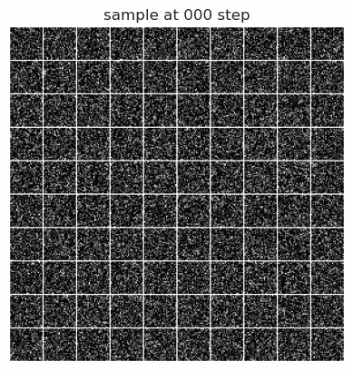
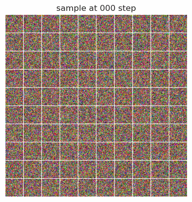

# Gaussian-Bernoulli Restricted Boltzmann Machines (GRBMs)
This is the official PyTorch implementation of [Gaussian-Bernoulli RBMs Without Tears](https://arxiv.org/abs/xxxx.xxxxx) as described in the following paper:

```
@article{liao2022grbm,
  title={Gaussian-Bernoulli RBMs Without Tears}, 
  author={Liao, Renjie and Kornblith, Simon and Ren, Mengye and Fleet, David J and Hinton, Geoffrey}, 
  journal={arXiv preprint arXiv:xxxx.xxxxx},
  year={2022}
}
```

## Sampling processes of learned GRBMs on MNIST and CelebA(32 X 32):



## Dependencies
Python 3, PyTorch(1.12.0). Other dependencies can be installed via ```pip install -r requirements.txt```


## Run Demos

### Train
* To run the training of experiment ```X``` where ```X``` is one of {```gmm_iso```, ```gmm_aniso```, ```mnist```, ```fashionmnist```, ```celeba```, ```celeba2K```}:

  ```python main.py -d X```

**Note**:

* Please check the folder ```config``` for the configuration jason files where most hyperparameters are self-explanatory.
* Important hyperparameters include:
    * CD_step: # CD steps to generate negative samples
    * inference_method: must be one of "Gibbs", "Langevin", "Gibbs-Langevin"
    * Langevin_step: # inner loop Langevin steps for Gibbs-Langevin sampling method
    * Langevin_eta: step size of both Langevin and Gibbs-Langevin sampling methods
    * Langevin_adjust_step: when set to ```X```, it enables Metropolis-Hastings adjustment from X-th to #CD-th steps 
    * is_vis_verbose: when set to True, it saves learned filters and hidden activations (conisder turning it off for better efficiency if you have too many filters and images are large)    
* For CelebA experiments, you need to download the dataset and set the relative path as ```data/celeba```

## Cite
Please consider citing our paper if you use this code in your research work.

## Questions/Bugs
Please submit a Github issue or contact rjliao@ece.ubc.ca if you have any questions or find any bugs.
